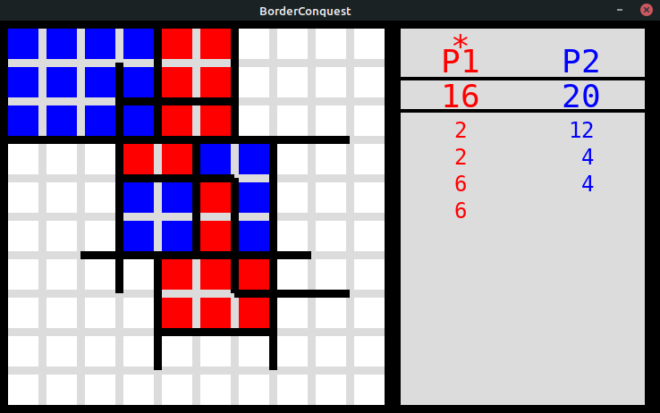
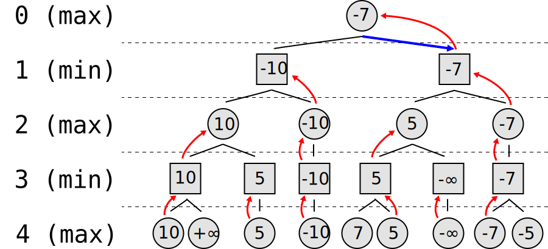

# BorderConquest
### This is an implementation of a pen & paper game I used to play years ago in school.

You can play it on [Replit](https://replit.com/@vinas94/BorderConquest?v=1) or on your local machine by cloning the repository (much faster).

 

## Rules
This is a two-player game that is played in turns. At every turn, the active player must place a straight border line of length 3 anywhere between the tiles. Border cannot be placed on top of existing borders, but they can cross them.

The goal of the game is to place the borders in such a way that encloses the most area. Once some particular area is closed off from the rest, it is attributed to the player who closed it.

The player who captures more than half of the area or who has captured more when there are no possible moves left to play wins.

## What's next
While it was fun making this game, the original idea remains to train an AI to play it. To do so a MiniMax algorithm will be employed (a diagram below). Using this algorithm the agent would evaluate all possible moves at the current state and for each of these moves, it would evaluate all possible subsequent moves of the opponent and so on and so forth. Doing so builds a tree of possibilities with every leaf denoting a certain state which is a result of a particular series of actions. With the tree ready, the agent can choose an optimal action.

The problem is that an exhaustive tree for this game is not possible, there are just too many possibilities. A shallow tree, few layers deep will have to be used instead. However, a tree just 3 layers deep means that at the start of the game on a 10x10 board the agent would need to evaluate more than 2.5M possibilities. Though this number could be reduced by applying some heuristics and filtering some posibilities.

The challenge therefore for now is to optimise the script to such an extent that hundreds of thousands of possibilities could be evaluated in a matter of seconds or less.

 

## **MiniMax algorithm**

